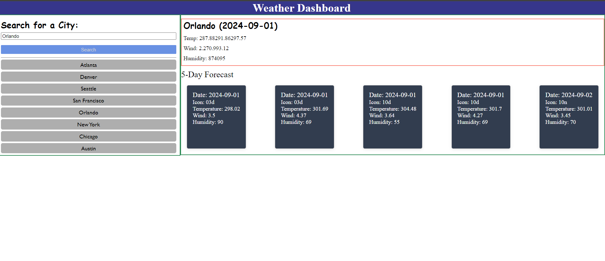

# SkyCast

SkyCast is a weather forecasting application that uses the [5 Day Weather Forecast API](https://openweathermap.org/forecast5) to retrieve and display weather data for cities. The app uses the Geocoding API to get latitude and longitude for the input city and then uses the weather forecast API to provide weather information for the next five days.

## Table of Contents

- [About the Project](#about-the-project)
- [Features](#features)
- [Installation](#installation)
- [Usage](#usage)
- [Contributing](#contributing)
- [License](#license)

## About the Project 

This app retrieves weather data for cities using the [5 Day Weather Forecast API](https://openweathermap.org/forecast5). Users input a city name, which is first processed by the Geocoding API to obtain latitude and longitude coordinates. These coordinates are then used to fetch a 5-day weather forecast, which is displayed to the user.


## Features

- **Local Storage Integration:** Preloads city names into the API, allowing users to view weather data for previously searched cities upon reload.
- **Dynamic Search:** Users can add major cities from a predefined list to the search bar with a single click.

## Installation

1. **Install Node.js:** Make sure Node.js is installed on your machine. You can download it from [nodejs.org](https://nodejs.org/).

2. **Install Dependencies:**
   Navigate to the project directory and run:
   ```bash
   npm install

